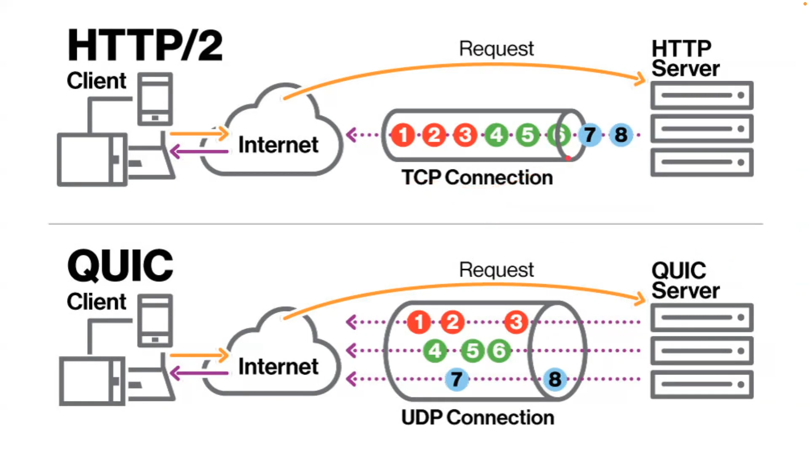
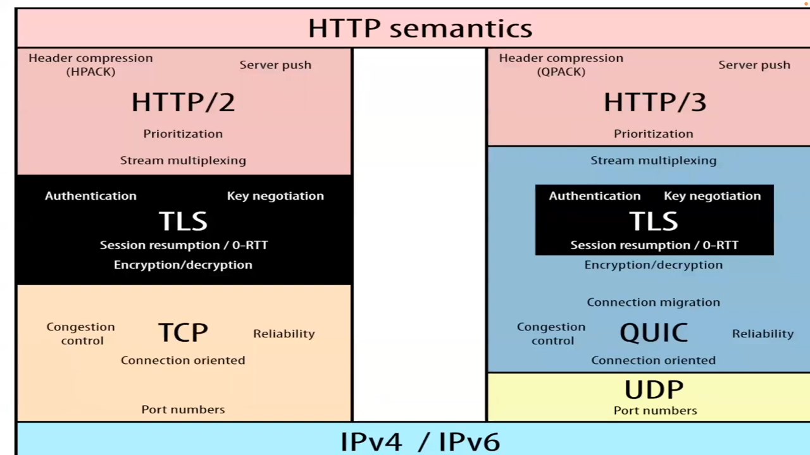

# QUIC and HTTP/3 Features - Congestion Control

## QUIC Congestion Control

Computer networks are complex. Many opposing and dynamic forces fight for faster speeds and optimum performance over a network. Naturally, we need a robust congestion handling mechanism to ensure the network does not crash because of these different influences.

### Network Performance and Congestion

We want to make our networks performant by sending **as much data as we can over a connection**, and also **as fast as we can**.

To send as much data, we are limited by **network bandwidth**. Bandwidth is simply the number of packets we can push through the network together at one go.

Our speed of pushing that data depends on **latency** and **round trip time (RTT)**.

#### Network Bandwidth

Network bandwidth is the maximum number of packets we can send together over it.

Network bandwidth depends on:

- **The physical medium of transmitting packets**
- **Number of other users on the network and their needs at a particular time**
- **The intermediary devices that route traffic between subnetworks**

#### Network Latency and Round Trip Time (RTT)

Latency and RTT depend on the **physical distance between the server and the client**.

### Network Congestion

We want to ideally send as many packets over the available bandwidth as we can to achieve **efficient performance**.

But, the flip side is **network congestion**.- if we send more packets than the network can transmit at a given point. 

We need to find a delicate balance between these opposing forces.

### Congestion Control

We use various **congestion control algorithms** to balance **network efficiency** with **congestion**.

But, it turns out several factors make designing the perfect congestion control algorithm a tough task.

#### Costly Packet Loss

If we try to send more packets than the number the available bandwidth can support, it leads to **congestion** and **packet loss**. Transport layers recover from this loss by **retransmitting the lost packets** . Now, if you retransmit these packets on a network with high RTT ( say , around 200 milliseconds), you could have very **costly packet losses**.

So, networks need to be **careful to reduce packet losses** by using optimum **congestion control** mechanisms.

#### Unknown Available Bandwidth

Another challenge to optimal congestion control is **unknown available bandwidth**. 

In computer networks, we can not know the available bandwidth for our connection before hand. There are many interconnecting devices between your client and the server. The **maximum available bandwidth** depends on the **weakest link in this chain** - or the **device with the minimum individual band-width**.

We cannot know this value before hand at the client end. 

#### Other Users Activity

We are not the only one sending data over the maximum bandwidth available to us.

There are other users who share it with us. Also, their needs fluctuate over time and so allocating bandwidth becomes a complex dynamic problem.

So, we design a  **congestion control ** mechanism that roughly works like this:

- We **start slow** by sending a small number of packets over the network. 
- We then **gradually send more packets at the same time**  to build-up speed.
- We do this until **we suffer a packet loss**.
- At this point, we have **congested the network**.
- We **track back** and send a **smaller number of packets** to test the bandwidth.
- We keep doing this dynamically and iteratively.

This is a simplified naive version of a congestion-control algorithm. Obviously, we try to optimize this basic version to achieve better results.

So, we are developing newer congestion-control algorithms and it is an evolving space.

### Congestion Control and Web Performance

So, we saw above that we need to **start slow** when we send data on a new connection to control network congestion.

This means our initial web page can have only a small amount of data to show first-up.

We would want to do better to load more of our **first paint** data ( the first data that displays on your website) to provide a richer user-experience.

### Congestion Control and the Promise of QUIC

QUIC promises to provide us with faster congestion control mechanisms on two counts:

- **QUIC has built-in Head of Line Blocking Removal Features ** So, QUIC is robust against heavy packet-loss. **Costly packet losses** are one of the main reasons for implementing congestion control. So, we could do with easier congestion control on QUIC to get **faster speeds**.

  

  

- **QUIC builds on top of UDP** - UDP is a bare-bones protocol and is fast per se. Also, UDP does not place any limit on the number of packets you can send at the same time. So, we could really get faster speeds with QUIC and easier congestion controls.

  

### QUIC - The Truth About Congestion Control

As with every other QUIC feature, there are nuances to its promise to support an easier congestion-control mechanism and fast speeds.

First, the Head of Line Blocking Removal feature in QUIC is **poorly implemented** because of opposing network forces. So, QUIC isn't as resilient to packet loss as seems on first sight.

Second, QUIC needs to be **reliable ** to be useful for HTTP data and so it has to manage congestion control.

Also, QUIC needs to give **other QUIC and TCP connections their due share of the bandwidth** . So, it cannot push data at any rate it pleases even though the underlying UDP allows it. 

So, QUIC also implements a congestion-control mechanism which is pretty similar to how TCP does it.

It starts slow in the initial phase, and builds up to faster speeds. QUIC uses **acknowledgements** to signify packet receipts and manage its push rate over the bandwidth.

In short, QUIC's congestion control still restricts its performance. You are **not going to obtain break-neck network speeds** with QUIC right away on the assumption that it has an easier congestion control mechanism.

### QUIC - Congestion Control and Speeds - The Bright Road Ahead

However, QUIP holds great promise to **optimise congestion control** *going forward* and improve network performance. 

#### QUIC is easy to deploy and update

QUIC builds  on top of the already widely supported UDP protocol. So, most end-points and middlebox devices support it.

Second, QUIC integrates TSL encryption by default. So, everything you send over QUIP is encrypted. This also includes meta data like packet headers. Due to this, intermediate network devices cannot read anything from the data passing through them over QUIC. The pleasant side-effect of this is that these middlebox devices cannot break the transmission even if they carry older versions or bugs.

**Congestion Control** algorithms are evolving continuously. QUIC can **easily update with these new algorithms** because it is easily **deployable even when updating** as we see above. So, it would **improve speed** as it loads newer and better congestion control algorithms.

